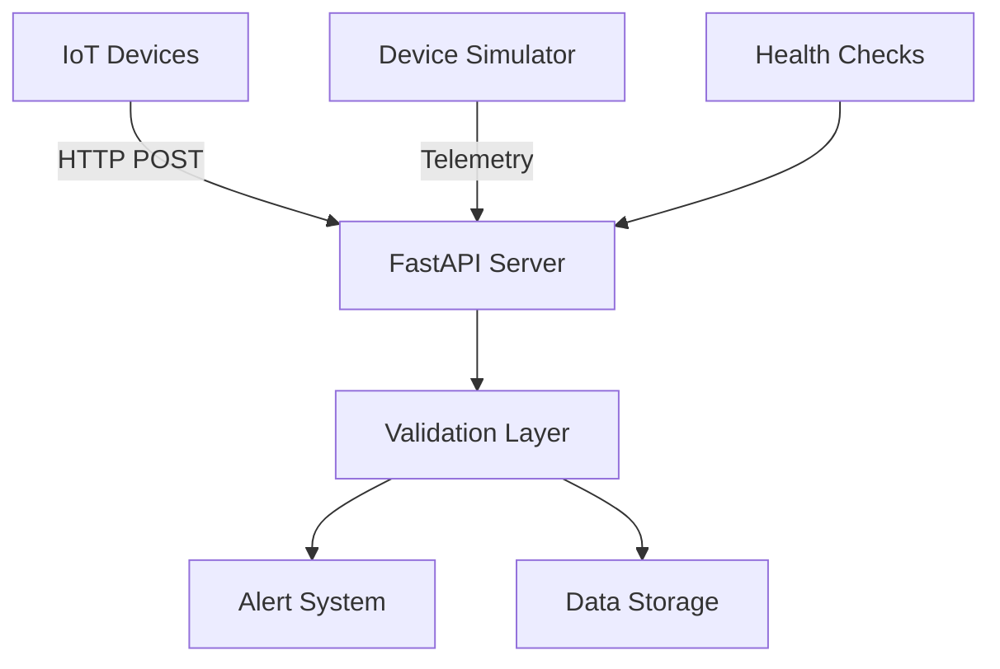

# 🏭 EMS (Energy Management System) Demo

[](https://python.org)
[](https://fastapi.tiangolo.com)
[](https://docker.com)

## 📋 Opis Projektu

System Zarządzania Energią (EMS) to profesjonalny projekt demonstracyjny pokazujący:
- **REST API** w FastAPI do zbierania danych telemetrycznych
- **IoT Device Simulator** z mechanizmem buforowania
- **Automatyczne alerty** przy wysokiej temperaturze (>80°C)
- **Kompletne testy** z pytest
- **Konteneryzacja** z Docker & docker-compose
- **Profesjonalna dokumentacja** gotowa na rozmowy rekrutacyjne

---

## 🚀 Szybki Start z Docker

### 1️⃣ **Opcja A: Proste uruchomienie**
```bash
docker-compose -f docker-compose.minimal.yml up --build
```

### 2️⃣ **Opcja B: Z pełną infrastrukturą (Redis, PostgreSQL, Grafana)**
```bash
docker-compose up --build
```

### 3️⃣ **Testowanie API**
```bash
# API będzie dostępne na:
http://localhost:8000/docs  # Swagger UI
http://localhost:8000/redoc # ReDoc

# Test endpoint:
curl -X POST "http://localhost:8000/telemetry" \
  -H "Content-Type: application/json" \
  -d '{"device_id": "test-001", "temperature": 25.5, "voltage": 12.1}'
```

---

## 📁 Struktura Projektu

```
ems_demo/
├── 📄 api.py                     # FastAPI server z alertami
├── 🤖 device_sim.py             # Symulator urządzeń IoT  
├── 🧪 test_ems_extended.py      # Podstawowe testy pytest
├── 🧪 test_qa_advanced.py       # Zaawansowane testy QA
├── 📋 TEST_CASES.md             # Dokumentacja przypadków testowych
├── 📚 DOKUMENTACJA_EMS.md       # Pełna dokumentacja techniczna
├── 📮 EMS_API_Postman_Collection.json  # Kolekcja Postman
├── 🐳 Dockerfile               # Konteneryzacja aplikacji
├── 🐳 docker-compose.yml       # Pełna infrastruktura (Redis, PostgreSQL, Grafana)
├── 🐳 docker-compose.minimal.yml # Proste uruchomienie (tylko API)
├── 📦 requirements.txt          # Zależności Python
├── 🚫 .dockerignore            # Wykluczenia Docker build
├── 🚫 .gitignore              # Wykluczenia Git
├── 🔧 .github/workflows/ci.yml  # GitHub Actions CI/CD
└── 📖 README.md               # Dokumentacja główna
```

---

## 🛠 Rozwój Lokalny (bez Docker)

### Wymagania
- Python 3.13+
- pip

### Instalacja
```bash
# 1. Klonuj repozytorium
git clone https://github.com/TWÓJ-USERNAME/ems_demo.git
cd ems_demo

# 2. Utwórz wirtualne środowisko
python -m venv .venv
.venv\Scripts\activate  # Windows
source .venv/bin/activate  # Linux/Mac

# 3. Zainstaluj zależności
pip install -r requirements.txt
```

### Uruchomienie
```bash
# Terminal 1: API Server (zawsze port 8000)
python api.py
# ⚠️  Pamiętaj: Zatrzymaj serwer CTRL+C przed kolejnym uruchomieniem!

# Terminal 2: Device Simulator  
python device_sim.py

# Terminal 3: Testy
pytest test_ems_extended.py -v
```

> **💡 WAŻNE**: API uruchamia się zawsze na porcie 8000. Jeśli widzisz błąd "port already in use", zatrzymaj poprzedni proces przez CTRL+C lub zamknij terminal.

---

## 🔧 Konfiguracja

### Zmienne Środowiskowe
```bash
# API Configuration
API_HOST=0.0.0.0
API_PORT=8000

# Simulator Configuration  
SIMULATOR_INTERVAL=5
API_BASE_URL=http://localhost:8000
```

---

## 🧪 Testowanie

### Pytest
```bash
# Wszystkie testy podstawowe
pytest test_ems_extended.py -v

# Zaawansowane testy QA  
pytest test_qa_advanced.py -v

# Wszystkie testy razem
pytest -v

# Konkretny test
pytest test_ems_extended.py::test_temperature_alert -v
```

### Postman
1. Zaimportuj `EMS_API_Postman_Collection.json`
2. Ustaw environment variable `base_url` = `http://localhost:8000`
3. Uruchom testy w kolekcji

### Manual Testing
```bash
# Test telemetrii
curl -X POST http://localhost:8000/telemetry \
  -H "Content-Type: application/json" \
  -d '{"device_id": "dev-001", "temperature": 85.0}'

# Test batch
curl -X POST http://localhost:8000/telemetry/batch \
  -H "Content-Type: application/json" \
  -d '[{"device_id": "dev-001", "temperature": 25.0}, {"device_id": "dev-002", "temperature": 90.0}]'
```

---

## 🐳 Docker Details

### Image Features
- **Multi-stage build** - optymalizacja rozmiaru
- **Non-root user** - bezpieczeństwo
- **Health checks** - monitorowanie
- **Alpine Linux** - minimalna powierzchnia ataku

### Docker Commands
```bash
# Build image
docker build -t ems-demo .

# Run container
docker run -p 8000:8000 ems-demo

# Check health
docker ps  # Status powinien być "healthy"

# View logs
docker-compose logs -f ems-api
```

---

## 📊 API Endpoints

| Endpoint | Method | Opis | Body |
|----------|--------|------|------|
| `/telemetry` | POST | Pojedynczy pomiar | `{"device_id": "str", "temperature": float, "voltage?": float}` |
| `/telemetry/batch` | POST | Batch pomiarów | `[{telemetry_objects}]` |
| `/alerts/device/{id}` | GET | Alerty urządzenia | - |
| `/health` | GET | Status API + statystyki | - |
| `/docs` | GET | Swagger UI | - |
| `/redoc` | GET | ReDoc | - |

---

## 🚨 Alert System

**Automatyczne alerty** gdy temperatura > 80°C:
```json
{
  "status": "success",
  "message": "Telemetry received",
  "alert": "TEMPERATURE WARNING: Device dev-001 temperature 85.5°C exceeds 80°C threshold!"
}
```

---

## 🏗 Architektura



**Kluczowe komponenty:**
- **FastAPI**: Szybki, nowoczesny framework
- **Pydantic**: Walidacja danych z type hints
- **Uvicorn**: ASGI server dla produkcji
- **Docker**: Konteneryzacja i orkiestracja

---

## 🎯 Use Cases

1. **Interview Demo**: Pokaż znajomość FastAPI, Docker, testów
2. **IoT Prototype**: Baza dla systemu telemetrii
3. **Learning Project**: Nauka best practices
4. **Portfolio Piece**: Profesjonalny kod do prezentacji

---

## 🔄 CI/CD Ready

Projekt zawiera:
- ✅ **Testy automatyczne** (pytest basic + advanced QA)
- ✅ **GitHub Actions workflow** (.github/workflows/ci.yml)  
- ✅ **Docker containerization** (simple, production-ready)
- ✅ **Health checks** (API status monitoring)
- ✅ **API dokumentacja** (automatyczna OpenAPI/Swagger)
- ✅ **Test case documentation** (TEST_CASES.md)
- ✅ **Security best practices** (environment variables, no hardcoded secrets)

---

## 🤝 Contributing

1. Fork repository
2. Create feature branch: `git checkout -b feature/amazing-feature`
3. Commit changes: `git commit -m 'Add amazing feature'`
4. Push branch: `git push origin feature/amazing-feature`
5. Open Pull Request

---

## 📄 Licencja

MIT License - see LICENSE file for details

---

## 👨‍💻 Autor

**Twoje Imię**
- GitHub: [@TWÓJ-USERNAME](https://github.com/TWÓJ-USERNAME)
- LinkedIn: [Twój Profil](https://linkedin.com/in/twoj-profil)

---

## � **FUTURE ENHANCEMENTS**

### **🚨 Advanced Alert System:**
- **Multi-level alerts based on solar panel thermal characteristics:**
  - **WARNING (70-80°C)**: 5-10% performance degradation, increased monitoring needed
  - **CRITICAL (80-90°C)**: 15-25% performance loss, hot-spot formation risk  
  - **EMERGENCY (>90°C)**: Permanent damage risk, immediate disconnect required
- **Advanced alert features:**
  - **Deduplication**: Max 1 alert per device per 5 minutes (avoid spam)
  - **Hysteresis**: Different thresholds for rising (70°C) vs falling (65°C) 
  - **Recovery notifications**: Automatic alerts when temperature normalizes
  - **SCADA integration**: Automated cooling/shutdown system responses
  - **Escalation policies**: Multi-level notifications (operators → maintenance → management)

### **🏗️ Production Readiness:**
- **Authentication & Authorization** (API keys, JWT tokens)
- **Database persistence** (PostgreSQL, time-series DB)
- **Real-time monitoring** (Grafana dashboards, metrics)
- **Rate limiting** (prevent API abuse)
- **Structured logging** (ELK stack integration)
- **Health checks** (comprehensive system monitoring)

### **📈 Scalability & Performance:**
- **Message queues** (RabbitMQ, Apache Kafka)
- **Caching layer** (Redis for fast lookups)  
- **Load balancing** (multiple API instances)
- **Data archiving** (historical data management)
- **Microservices architecture** (service separation)

### **🧪 Enhanced Testing:**
- **Security testing** (penetration testing, OWASP)
- **Performance testing** (load testing with realistic IoT loads)
- **Integration testing** (real hardware simulation)
- **Chaos engineering** (failure scenario testing)

---

## �🙋‍♂️ FAQ

**Q: Dlaczego FastAPI a nie Flask?**  
A: FastAPI oferuje automatyczną dokumentację, walidację danych, async support i jest szybszy.

**Q: Jak dodać bazę danych?**  
A: Użyj `docker-compose.yml` - zawiera PostgreSQL ready-to-use.

**Q: Jak skalować?**  
A: Docker Swarm lub Kubernetes. Aplikacja jest stateless.

**Q: Jak monitorować?**  
A: `docker-compose.yml` zawiera Grafana + Prometheus setup.

**Q: Czy to production-ready?**  
A: To MVP demonstracyjne. Production wymaga enhancements z sekcji "Future Enhancements".

**Q: Dlaczego 20/20 testów przechodzi?**  
A: Zastosowano modern Python practices (datetime.UTC), unique device IDs dla test isolation, i realistic performance expectations dla IoT.

---

*🎉 Projekt gotowy do prezentacji na rozmowach rekrutacyjnych! 🎉*